# Enterprise harness flow diagrams

These six diagrams describe the implementation in this checkout: enterprise
package **0.1.0**, extension API **0.2.5**, and configuration template **v52**.
Open the [offline diagram viewer](enterprise-flow.html) to zoom, scroll, print,
or download the SVGs without a Mermaid renderer or an internet connection.
The Mermaid blocks below are the editable sources. The
[enterprise services guide](enterprise-services.md) owns the setup and API contracts.

## Reading the diagrams

| Appearance | Meaning |
| --- | --- |
| Blue | Existing DeerFlow engine and application behavior |
| Green | Implemented enterprise extension behavior |
| Purple cylinder | Persistent state or generated artifacts |
| Gold diamond | Admission, validation, or lifecycle decision |
| Orange dashed border / dashed arrow | Company-operated service or integration to supply |
| Red | Rejection, failure, or publication block |

Arrows describe control or data flow, not an additional service deployment.
The remote broker adapter is implemented; its isolation enforcement belongs to
the approved remote service. Typesense currently receives an exported metadata
file; there is no implemented index worker or Typesense request router.

## 1. End-to-end overview


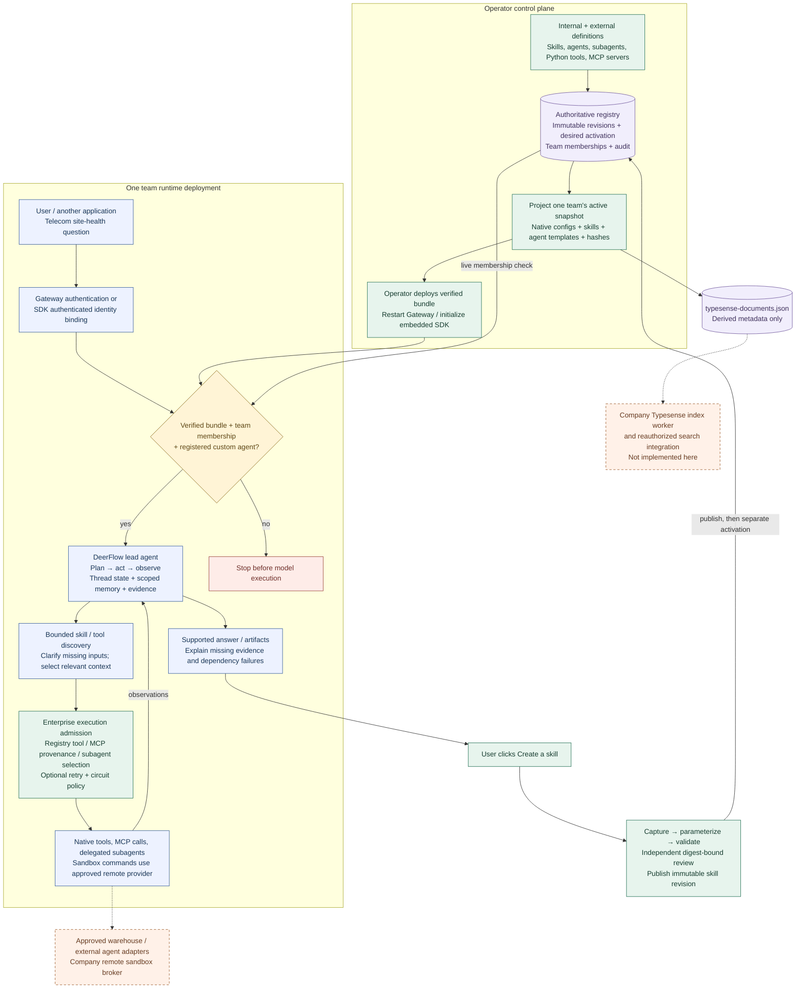

Each Gateway deployment serves one team. Multiple deployments share a registry;
the running engine does not switch team configurations dynamically. The default
lead agent is an engine entry point; selected custom agents and delegated subagent
names must be in the deployed snapshot. Remote agents require an approved native
MCP/Python adapter; `origin: external` alone does not implement a protocol.

## 2. Registry, activation, deployment, and rollback


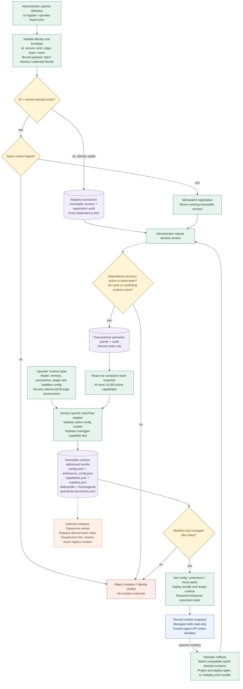

Publication and activation do not change a running agent. Deployment applies the
snapshot. Membership is checked live before the model and again before tool calls.
Registering an envelope is distinct from native configuration validation during
projection. Registry storage is SQLite locally or PostgreSQL across deployments;
DeerFlow's application checkpoints and memory remain separate responsibilities.

## 3. Prompt routing, clarification, and agent execution


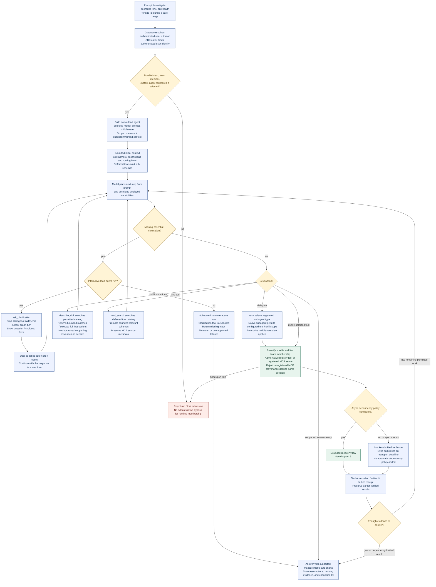

The deployed catalogs drive discovery today; Typesense is not in this request path.
Template defaults bound prompt name previews to **50 per catalog**, discovery matches to **5**,
and active deferred tool schemas to **20**. Operators can configure these limits.
Exact skill selection and subsequent resource reads are distinct from catalog
search. Clarification is existing DeerFlow behavior, not an enterprise UI action.

## 4. Create a skill: evidence to immutable release


```mermaid
flowchart TB
  accTitle: Evidence to reviewed immutable skill
  accDescr: Terminal-run capture, expiring drafts, explicit parameterization, validation, independent review, immutable publication, and TTL cleanup.
  FINISH["Conversation reaches a terminal run<br/>Success, failure, interruption, or cancellation"]:::core
  CLICK["User clicks Create a skill"]:::enterprise
  AUTH["Host authorizes plugin action<br/>Request-scoped RunEvidenceReader<br/>Owner-visible evidence; no global reader fallback"]:::core
  TERMINAL{"Visible terminal run available?"}:::gate
  REJECT["Reject capture / publication<br/>Unavailable, running, expired, or unauthorized"]:::stop
  CAPTURE[("Expiring draft: captured<br/>Owner + team + thread/run references<br/>Event receipts and content hashes only")]:::data
  EDIT["User writes reusable recipe<br/>Instructions + SQL/text resources<br/>JSON Schema parameters + example inputs<br/>Reviewed table DDL / digests + dependency pins"]:::enterprise
  PARAM[("Draft: parameterized<br/>Invalidate previous validation and review")]:::data
  STRUCT["Structural validation<br/>Closed parameter schema + valid examples<br/>Path / resource limits + table reference shape<br/>Native package analyzer and SkillScan"]:::enterprise
  DOMAIN["Operator-configured telecom validator<br/>Schema freshness, permissions, approved joins<br/>BQ dry runs / cost bounds / expected behavior<br/>Company integration required"]:::external
  VALID{"All required checks pass?<br/>Evidence complete; draft unchanged?"}:::gate
  FIX["Validation blocked<br/>Show findings; revise recipe<br/>Configure unavailable required validator"]:::stop
  REPORT[("Draft: validated<br/>Exact candidate digest + scan findings<br/>Semantic receipt digest")]:::data
  REVIEW["Different authenticated administrator<br/>Reviews exact validated digest + notes"]:::enterprise
  APPROVE{"Independent review approves<br/>same current digest?"}:::gate
  REVISE["Review rejected / stale digest<br/>Revise, revalidate, and review again"]:::stop
  REVIEWED[("Draft: reviewed<br/>Reviewer identity + digest + decision")]:::data
  PUBLISH["Owner / permitted administrator publishes<br/>Check validation, review, expiry, and identity<br/>Atomic registration + draft publication + audit"]:::enterprise
  RELEASE[("Immutable skill ID + version<br/>Package bytes + exact dependencies<br/>Evidence digest + validation/review provenance")]:::data
  DEPLOY["Separate administrator activation<br/>Project and deploy a new bundle<br/>See diagram 2"]:::enterprise
  PURGE["TTL cleanup, every minute while service runs<br/>Default draft lifetime: 24 hours<br/>Temporary draft removed; immutable release retained"]:::enterprise
  FINISH --> CLICK --> AUTH --> TERMINAL
  TERMINAL -->|no| REJECT
  TERMINAL -->|yes| CAPTURE --> EDIT --> PARAM --> STRUCT --> DOMAIN --> VALID
  VALID -->|no| FIX --> EDIT
  VALID -->|yes| REPORT --> REVIEW --> APPROVE
  APPROVE -->|no| REVISE --> EDIT
  APPROVE -->|yes| REVIEWED --> PUBLISH --> RELEASE --> DEPLOY
  REPORT -->|recipe edited| EDIT
  REVIEWED -->|recipe edited| EDIT
  CAPTURE -->|expiry| PURGE
  RELEASE -->|temporary draft expires| PURGE
  classDef core fill:#edf2ff,stroke:#365c99,color:#193656;
  classDef enterprise fill:#e7f4ed,stroke:#247056,color:#173d30;
  classDef data fill:#f1eefc,stroke:#72599d,color:#40325d;
  classDef gate fill:#fff4d6,stroke:#8b671a,color:#5d4614;
  classDef external fill:#fff1e8,stroke:#9c5b2b,color:#663b21,stroke-dasharray:5 4;
  classDef stop fill:#feece8,stroke:#9a433b,color:#6e2e29;
```

The sample recipe does not automatically reproduce the last answer. Users enter
the logic and table references explicitly. Capture stores hashes rather than raw
customer rows or complete prompts, and is bounded to **1,000 evidence events**.
The plugin requires semantic validation by default; a missing validator blocks
publication. A standalone `Workflow` can deliberately allow structural-only
validation for development. Candidate scripts/queries are not executed by the
structural validator. Telecom identifier mappings must be approved by the domain
validator rather than inferred from matching column names.

## 5. Bounded retries, circuit breakers, and partial results


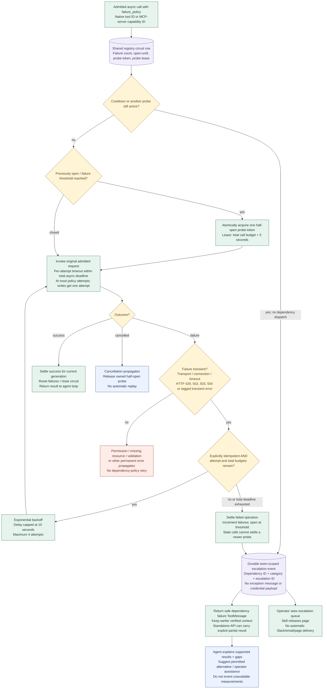

Default policy: **1 attempt**, **20 seconds per attempt**, **30 seconds total**,
**3 failed operations before opening**, and **30 seconds cooldown**. No policy is
automatically attached to every tool. MCP-server policy covers its exposed tools;
keep mixed read/write servers non-retryable. Synchronous embedded execution checks
admission and invokes once, relying on the tool's own transport deadline. Async
cancellation cannot guarantee termination of blocking code already running in a
worker thread; remote process deadlines must be enforced by the broker.

## 6. Approved remote sandbox lifecycle and enforcement


```mermaid
flowchart TB
  accTitle: Approved remote sandbox lifecycle
  accDescr: Approved HTTPS configuration, owner-bound leases, exact policy receipts, remote enforcement, terminal output, and release fencing.
  CONFIG["Operator selects RemoteSandboxProvider<br/>Exact approved HTTPS origin + token environment<br/>CPU, memory, disk, lifetime, command, network policy"]:::enterprise
  VALID{"Endpoint approved, token present,<br/>fixed roots and exact domains valid?"}:::gate
  BLOCK["Reject provider / lease / operation<br/>No local-shell fallback; no ambiguous RPC replay"]:::stop
  OWNER["Acquire for authenticated user + thread"]:::core
  REUSE{"Same owner has live unfenced lease?"}:::gate
  CREATE["POST /v1/sandboxes<br/>Protocol 1 + user/thread + full policy"]:::enterprise
  BROKER["Company-operated approved HTTPS broker<br/>Creates isolated worker and enforces policy<br/>Infrastructure integration required"]:::external
  RECEIPT{"Safe unique lease ID, correct identity,<br/>valid expiry, identical enforced policy?"}:::gate
  CLEANUP["Reject receipt and request lease cleanup<br/>Never delete a tracked foreign lease on ID collision"]:::enterprise
  TRACK[("Provider in-memory owner map<br/>Lease ID + user/thread + expiry + fenced state")]:::data
  SKILLS["Scoped skill upload<br/>Reject symlinks; bound files and bytes<br/>POST /v1/sandboxes/id/skills"]:::enterprise
  MOUNT["Broker atomically replaces<br/>read-only /mnt/skills mount"]:::external
  OP["Execute / read / write / download / search<br/>Check tracked live lease and approved paths<br/>Bound transfer; clip command timeout to remaining TTL"]:::enterprise
  ENFORCE["Remote worker enforces OS controls<br/>CPU / memory / disk caps; filesystem containment<br/>Writable /mnt/user-data, read-only /mnt/skills<br/>Approved egress only; block metadata/control planes<br/>Kill process group at command deadline"]:::external
  TERMINAL{"Command terminated and response bounded?"}:::gate
  OBSERVE["Return terminal output / file / search result<br/>Agent loop observes supported evidence"]:::core
  RELEASE["Release marks lease fenced first<br/>DELETE /v1/sandboxes/id outside metadata lock"]:::enterprise
  DELETED{"Delete confirmed?"}:::gate
  FORGET["Remove owner map + lease entry"]:::enterprise
  FENCE["Keep lease fenced on ambiguous failure<br/>Retained handles cannot dispatch<br/>Operator deletion retry / broker TTL expiry"]:::enterprise
  CONFIG --> VALID
  VALID -->|no| BLOCK
  VALID -->|yes| OWNER --> REUSE
  REUSE -->|yes| TRACK
  REUSE -->|no| CREATE -.-> BROKER
  BROKER -.->|policy receipt| RECEIPT
  RECEIPT -->|no| CLEANUP --> BLOCK
  RECEIPT -->|yes| TRACK --> SKILLS -.-> MOUNT
  MOUNT -.-> OP -.-> ENFORCE
  ENFORCE -.-> TERMINAL
  TERMINAL -->|no| BLOCK
  TERMINAL -->|yes| OBSERVE
  OBSERVE -->|more admitted operations| OP
  OBSERVE -->|lifecycle cleanup| RELEASE --> DELETED
  DELETED -->|yes| FORGET
  DELETED -->|no| FENCE
  classDef core fill:#edf2ff,stroke:#365c99,color:#193656;
  classDef enterprise fill:#e7f4ed,stroke:#247056,color:#173d30;
  classDef data fill:#f1eefc,stroke:#72599d,color:#40325d;
  classDef gate fill:#fff4d6,stroke:#8b671a,color:#5d4614;
  classDef external fill:#fff1e8,stroke:#9c5b2b,color:#663b21,stroke-dasharray:5 4;
  classDef stop fill:#feece8,stroke:#9a433b,color:#6e2e29;
```

Defaults: **1 CPU**, **512 MB memory**, **512 MB disk**, **900-second lease**,
**60-second command deadline**, **1 MB per file**, **16 MB / 2,000 files per skill
projection**. Empty network domains mean isolated networking. The client checks
receipts and paths; only the approved remote service can enforce OS isolation.
The adapter does not provision a broker or certify an infrastructure provider.
Python tools, plugins, and stdio MCP processes still run in their configured host
environment; selecting a sandbox provider does not sandbox all Gateway code.

## Implementation map and maintenance

| Diagram | Source of truth |
| --- | --- |
| Registry and deployment | [registry.py](../extensions/enterprise/deerflow_enterprise/registry.py), [adapter.py](../extensions/enterprise/deerflow_enterprise/adapter.py), [operator CLI](../extensions/enterprise/deerflow_enterprise/__main__.py) |
| Request execution | [enterprise middleware](../extensions/enterprise/deerflow_enterprise/runtime.py), [lead agent](../backend/packages/harness/deerflow/agents/lead_agent/agent.py), [tool discovery](../backend/packages/harness/deerflow/tools/builtins/tool_search.py), [skill discovery](../backend/packages/harness/deerflow/skills/describe.py), [clarification](../backend/packages/harness/deerflow/agents/middlewares/clarification_middleware.py) |
| Skill publication | [workflow.py](../extensions/enterprise/deerflow_enterprise/workflow.py), [plugin/service](../extensions/enterprise/deerflow_enterprise/__init__.py), [browser action](../extensions/enterprise/deerflow_enterprise/static/index.mjs) |
| Recovery | [resilience.py](../extensions/enterprise/deerflow_enterprise/resilience.py) |
| Sandbox | [sandbox.py](../extensions/enterprise/deerflow_enterprise/sandbox.py) |

Keep this Markdown and its rendered SVGs synchronized when behavior changes.
[render_enterprise_flow.mjs](../scripts/render_enterprise_flow.mjs) rebuilds the
SVGs from these Mermaid blocks using a development-only renderer; the HTML viewer
and exported diagrams have no runtime dependencies. Follow the regeneration
instructions in that script. Do not hand-edit generated SVG node labels.

The enterprise package remains separately versioned. Upstream updates require
qualification of the extension API and host-specific config, review, provenance,
skill-storage, and sandbox interfaces; these diagrams do not promise a permanent
API guarantee. See [compatibility and verification](enterprise-services.md#upstream-compatibility-and-verification).
